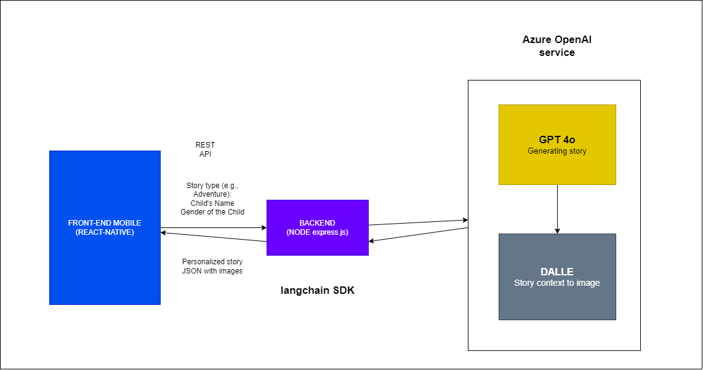

# Playful Pages

Playful Pages is an interactive app for kids where AI generates bedtime stories with images. The app aims to provide an engaging and educational experience for children.

## Features

- AI-generated bedtime stories
- Interactive images
- User-friendly interface

## Project Structure

- **Front-end**: React Native (located in the `playfulpages` directory)
- **Back-end**: Node.js with Express

## Installation

1. Clone the repository:
    ```sh
    git clone https://github.com/yourusername/playfulpages.git
    ```
2. Navigate to the project directory:
    ```sh
    cd playfulpages
    ```

### Front-end Setup

1. Install dependencies:
    ```sh
    npm install
    ```
2. Start the React Native development server:
    ```sh
    npm start
    ```

### Back-end Setup

1. Navigate to the backend directory:
    ```sh
    cd backend
    ```
2. Install dependencies:
    ```sh
    npm install
    ```
3. Start the Express server:
    ```sh
    npm start
    ```

## Usage

1. Open the app on your device/emulator.
2. Explore the interactive bedtime stories generated by AI.

### Detailed Workflow



#### Frontend Mobile (React Native):

- Serves as the user interface where users (parents or children) provide input for story generation.
- Inputs include:
  - Story Type: e.g., adventure, bedtime, or educational.
  - Child's Name: To personalize the story.
  - Child's Gender: To tailor character references in the story.
- Sends this information to the backend for processing.

#### Backend (Node.js + Express):

- Orchestrates the entire process by communicating between the frontend and Azure OpenAI services.
- Accepts user inputs, validates them, and prepares the request for story and image generation.

#### AI Services (Azure OpenAI):

- **GPT-4o Model**: Generates a fully personalized story based on the provided inputs (story type, child's name, and gender). This ensures the story is engaging, age-appropriate, and contextually relevant.
- **DALL·E Model**: Creates visual illustrations for the story by analyzing the generated story's context. Each image complements the narrative, enhancing the storytelling experience.

#### Workflow

##### User Interaction:

- The user inputs the story type, child’s name, and gender via the React Native mobile app.
- The app sends these details to the backend.

##### Backend Processing:

- The backend validates the input data and forwards a request to GPT-4o in Azure OpenAI.
- GPT-4o generates a customized story based on the input parameters.

##### Story to Illustration:

- The generated story is sent to DALL·E (also in Azure OpenAI) for image generation.
- DALL·E analyzes the context of the story and creates relevant illustrations for key scenes.

##### Final Output:

- The backend packages the story and images together in JSON format and sends them back to the mobile app.
- The user views the complete storybook, enriched with visuals, creating an engaging and interactive experience.

## Demo


## Contact
For any inquiries, please contact [sr.vikash.it@gmail.com](mailto:sr.vikash.it@gmail.com).
